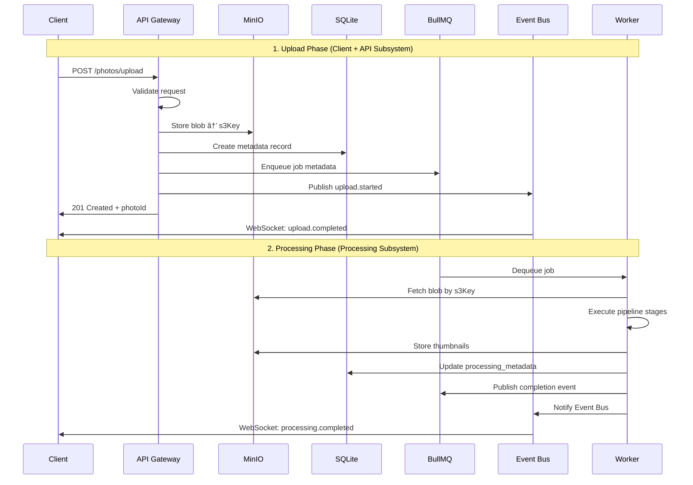

# Photo Management System - Broker-Centric Architecture

## 🎯 Architectural Philosophy

This system follows a **message broker-centric design** where **BullMQ (Redis)** serves as the central coordination point between two independent subsystems:

1. **Client + API Subsystem** - Handles uploads, sessions, and client interactions
2. **Processing Subsystem** - Executes async photo processing pipelines

The two subsystems **never communicate directly**. They only interact through:
- **BullMQ** for job coordination
- **Shared Storage** (MinIO + SQLite) for data exchange
- **Event Bus** for real-time client notifications

---

## 🏗️ System Architecture

```
┌─────────────────────────────────────────────────────────────────────┐
│                      CLIENT + API SUBSYSTEM                         │
├─────────────────────────────────────────────────────────────────────┤
│                                                                     │
│  📱 Web/Mobile Clients                                              │
│         ↕ HTTPS/WebSocket                                           │
│  🌐 API Gateway                                                     │
│     ├─ Upload Endpoints                                             │
│     ├─ Session Management                                           │
│     └─ Authentication/Validation                                    │
│         │                                                           │
│         ├──▶ 💾 MinIO (Store Blob)                                 │
│         ├──▶ 🗄️ SQLite (Create Metadata Record)                    │
│         └──▶ 📨 BullMQ (Enqueue Job Metadata)                      │
│                                                                     │
└─────────────────────────────────────────────────────────────────────┘
                              ↕
┌─────────────────────────────────────────────────────────────────────┐
│                    SHARED INFRASTRUCTURE LAYER                      │
├─────────────────────────────────────────────────────────────────────┤
│                                                                     │
│  📨 BullMQ (Redis)                  💾 Storage Layer                │
│     ├─ Job Queues                      ├─ MinIO (Blobs)            │
│     ├─ Priority Management             ├─ SQLite (Metadata)         │
│     ├─ Retry Policies                  └─ Consistency Manager      │
│     └─ Dead Letter Queue                                           │
│                                                                     │
│  🔔 Event Bus                                                       │
│     ├─ Redis Pub/Sub                                               │
│     ├─ WebSocket Bridge                                            │
│     └─ Client Room Management                                      │
│                                                                     │
└─────────────────────────────────────────────────────────────────────┘
                              ↕
┌─────────────────────────────────────────────────────────────────────┐
│                      PROCESSING SUBSYSTEM                           │
├─────────────────────────────────────────────────────────────────────┤
│                                                                     │
│  ⚡ Worker Pool                                                     │
│     ├─ Job Consumer (BullMQ)                                       │
│     ├─ Pipeline Orchestrator                                       │
│     └─ Processor Registry                                          │
│         │                                                           │
│         ├──▶ 💾 MinIO (Fetch Blob)                                 │
│         ├──▶ 🔧 Process (Thumbnails, Validation, etc)              │
│         ├──▶ 💾 MinIO (Store Results)                              │
│         ├──▶ 🗄️ SQLite (Update Metadata)                           │
│         └──▶ 📨 BullMQ (Publish Completion Event)                  │
│                                                                     │
└─────────────────────────────────────────────────────────────────────┘
```

---

## 🔄 Data Flow: Photo Upload to Processing

### Sequence Diagram



---

## 📨 BullMQ Job Structure

### Job Metadata Schema

```typescript
// Job enqueued by API Gateway
interface PhotoProcessingJob {
  // Job Identification
  id: string;                    // Job ID (generated by BullMQ)
  photoId: string;               // Photo UUID (database primary key)
  
  // Storage References
  storage: {
    s3Key: string;               // MinIO object key
    bucket: string;              // MinIO bucket name
    originalSize: number;        // File size in bytes
    mimeType: string;            // image/jpeg, etc
  };
  
  // Processing Configuration
  pipeline: {
    name: string;                // 'full_processing' | 'quick_processing'
    stages: string[];            // ['validation', 'thumbnails', 'metadata']
    priority: number;            // 1-10
  };
  
  // Context Metadata
  context: {
    clientId: string;            // Client identifier
    sessionId?: string;          // Upload session
    uploadedAt: string;          // ISO timestamp
    traceId: string;             // Distributed tracing ID
  };
  
  // BullMQ Options
  opts: {
    attempts: 3;                 // Retry count
    backoff: {
      type: 'exponential';
      delay: 5000;               // Initial delay in ms
    };
    removeOnComplete: true;      // Cleanup after success
    removeOnFail: false;         // Keep failed jobs for debugging
  };
}
```

### Job Queue Configuration

```typescript
// API Gateway - Job Producer
class JobProducer {
  private queue: Queue;
  
  constructor() {
    this.queue = new Queue('photo-processing', {
      connection: {
        host: 'redis',
        port: 6379
      },
      defaultJobOptions: {
        attempts: 3,
        backoff: {
          type: 'exponential',
          delay: 5000
        },
        removeOnComplete: 100,      // Keep last 100 completed
        removeOnFail: 1000          // Keep last 1000 failed
      }
    });
  }
  
  async enqueuePhotoProcessing(
    photoId: string,
    storageInfo: StorageInfo,
    pipelineConfig: PipelineConfig
  ): Promise<string> {
    
    const job = await this.queue.add(
      'process-photo',              // Job name
      {
        photoId,
        storage: storageInfo,
        pipeline: pipelineConfig,
        context: {
          clientId: req.clientId,
          sessionId: req.sessionId,
          uploadedAt: new Date().toISOString(),
          traceId: req.traceId
        }
      },
      {
        priority: pipelineConfig.priority || 5,
        jobId: `photo:${photoId}`,  // Prevent duplicate jobs
      }
    );
    
    logger.info(`Enqueued processing job for photo ${photoId}`, {
      jobId: job.id,
      queue: 'photo-processing'
    });
    
    return job.id;
  }
}

// Worker - Job Consumer
class JobConsumer {
  private worker: Worker;
  
  constructor(private processingService: ProcessingService) {
    this.worker = new Worker(
      'photo-processing',
      async (job) => this.processJob(job),
      {
        connection: {
          host: 'redis',
          port: 6379
        },
        concurrency: 3,             // Process 3 jobs concurrently
        limiter: {
          max: 10,                  // Max 10 jobs
          duration: 1000            // per second
        }
      }
    );
    
    this.setupEventHandlers();
  }
  
  async processJob(job: Job<PhotoProcessingJob>): Promise<ProcessingResult> {
    const { photoId, storage, pipeline, context } = job.data;
    
    logger.info(`Processing job ${job.id} for photo ${photoId}`);
    
    // Update job progress
    await job.updateProgress(10);
    
    // Fetch blob from storage
    const blob = await this.fetchBlob(storage.s3Key);
    await job.updateProgress(20);
    
    // Execute pipeline
    const result = await this.processingService.executePipeline(
      pipeline.name,
      {
        photoId,
        blob,
        metadata: storage
      },
      {
        onStageComplete: async (stage, progress) => {
          await job.updateProgress(20 + (progress * 0.8));
        }
      }
    );
    
    await job.updateProgress(100);
    
    return result;
  }
  
  setupEventHandlers(): void {
    this.worker.on('completed', (job, result) => {
      logger.info(`Job ${job.id} completed`, { photoId: job.data.photoId });
      
      // Publish completion event to Event Bus
      this.publishEvent('photo.processing.completed', {
        photoId: job.data.photoId,
        result
      });
    });
    
    this.worker.on('failed', (job, error) => {
      logger.error(`Job ${job.id} failed`, {
        photoId: job.data.photoId,
        error: error.message,
        attempts: job.attemptsMade
      });
      
      // Publish failure event
      this.publishEvent('photo.processing.failed', {
        photoId: job.data.photoId,
        error: error.message
      });
    });
  }
}
```

---

## 🔔 Event Bus Architecture

The Event Bus is a **separate service** that bridges BullMQ events to WebSocket clients.

### Event Bus Service

```typescript
// Event Bus - Decoupled from API and Workers
class EventBusService {
  private io: Server;                    // Socket.io server
  private redis: Redis;                  // Redis pub/sub
  private roomManager: RoomManager;
  
  constructor() {
    // Setup WebSocket server
    this.io = new Server(3001, {
      cors: { origin: '*' }
    });
    
    // Setup Redis subscriber
    this.redis = new Redis({
      host: 'redis',
      port: 6379
    });
    
    this.roomManager = new RoomManager(this.io);
    this.setupSubscriptions();
    this.setupClientHandlers();
  }
  
  setupSubscriptions(): void {
    // Subscribe to Redis pub/sub channels
    this.redis.subscribe(
      'photo:upload',
      'photo:processing',
      'photo:completion'
    );
    
    this.redis.on('message', (channel, message) => {
      const event = JSON.parse(message);
      this.broadcastEvent(channel, event);
    });
  }
  
  setupClientHandlers(): void {
    this.io.on('connection', (socket) => {
      logger.info(`Client connected: ${socket.id}`);
      
      // Client identifies itself
      socket.on('identify', ({ clientId, sessionId }) => {
        // Join client-specific room
        this.roomManager.joinRoom(socket, `client:${clientId}`);
        
        // Join session-specific room if provided
        if (sessionId) {
          this.roomManager.joinRoom(socket, `session:${sessionId}`);
        }
        
        socket.emit('identified', { socketId: socket.id });
      });
      
      // Client subscribes to specific photo
      socket.on('subscribe:photo', ({ photoId }) => {
        this.roomManager.joinRoom(socket, `photo:${photoId}`);
      });
    });
  }
  
  broadcastEvent(channel: string, event: any): void {
    const { type, data, metadata } = event;
    
    switch (channel) {
      case 'photo:upload':
        // Broadcast to client and session rooms
        if (metadata.clientId) {
          this.io.to(`client:${metadata.clientId}`).emit('upload.event', event);
        }
        if (metadata.sessionId) {
          this.io.to(`session:${metadata.sessionId}`).emit('upload.event', event);
        }
        break;
        
      case 'photo:processing':
        // Broadcast to photo-specific room
        if (data.photoId) {
          this.io.to(`photo:${data.photoId}`).emit('processing.event', event);
        }
        break;
        
      case 'photo:completion':
        // Broadcast to all relevant rooms
        if (data.photoId) {
          this.io.to(`photo:${data.photoId}`).emit('completion.event', event);
        }
        if (metadata.clientId) {
          this.io.to(`client:${metadata.clientId}`).emit('completion.event', event);
        }
        break;
    }
  }
}

// Event Publishers (used by API and Workers)
class EventPublisher {
  private redis: Redis;
  
  constructor() {
    this.redis = new Redis({
      host: 'redis',
      port: 6379
    });
  }
  
  async publishUploadEvent(event: UploadEvent): Promise<void> {
    await this.redis.publish(
      'photo:upload',
      JSON.stringify({
        type: event.type,
        data: event.data,
        metadata: event.metadata,
        timestamp: new Date().toISOString()
      })
    );
  }
  
  async publishProcessingEvent(event: ProcessingEvent): Promise<void> {
    await this.redis.publish(
      'photo:processing',
      JSON.stringify({
        type: event.type,
        data: event.data,
        metadata: event.metadata,
        timestamp: new Date().toISOString()
      })
    );
  }
}
```

---

## 🔄 Component Interaction Patterns

### 1. API Gateway Responsibilities

```typescript
// API Gateway - Upload Handler
class PhotoUploadHandler {
  constructor(
    private storage: StorageCoordinator,
    private jobProducer: JobProducer,
    private eventPublisher: EventPublisher
  ) {}
  
  async handleUpload(req: Request, res: Response): Promise<void> {
    const { file, clientId, sessionId } = req;
    const photoId = generateUUID();
    const traceId = req.traceId || generateTraceId();
    
    try {
      // 1. Store blob in MinIO
      const storageResult = await this.storage.storePhoto(
        photoId,
        file.buffer,
        {
          originalName: file.originalname,
          mimeType: file.mimetype,
          clientId,
          sessionId
        }
      );
      
      // 2. Create metadata record in SQLite
      await this.storage.createPhotoRecord({
        id: photoId,
        s3Key: storageResult.s3Key,
        s3Url: storageResult.s3Url,
        fileSize: file.size,
        mimeType: file.mimetype,
        clientId,
        sessionId,
        uploadedAt: new Date().toISOString(),
        processingStatus: 'queued'
      });
      
      // 3. Enqueue processing job
      const jobId = await this.jobProducer.enqueuePhotoProcessing(
        photoId,
        {
          s3Key: storageResult.s3Key,
          bucket: storageResult.bucket,
          originalSize: file.size,
          mimeType: file.mimetype
        },
        {
          name: 'full_processing',
          stages: ['validation', 'thumbnails', 'metadata', 'optimization'],
          priority: 5
        }
      );
      
      // 4. Publish upload event
      await this.eventPublisher.publishUploadEvent({
        type: 'photo.uploaded',
        data: {
          photoId,
          s3Url: storageResult.s3Url,
          jobId
        },
        metadata: {
          clientId,
          sessionId,
          traceId
        }
      });
      
      // 5. Return response immediately
      res.status(201).json({
        success: true,
        data: {
          photoId,
          jobId,
          status: 'queued',
          message: 'Photo uploaded and queued for processing'
        }
      });
      
    } catch (error) {
      logger.error('Upload failed', { error, photoId, traceId });
      
      // Cleanup on failure
      if (storageResult?.s3Key) {
        await this.storage.deleteBlob(storageResult.s3Key);
      }
      
      throw error;
    }
  }
}
```

### 2. Worker Responsibilities

```typescript
// Worker - Processing Logic
class PhotoProcessor {
  constructor(
    private storage: StorageCoordinator,
    private pipelineOrchestrator: PipelineOrchestrator,
    private eventPublisher: EventPublisher
  ) {}
  
  async processPhoto(job: Job<PhotoProcessingJob>): Promise<ProcessingResult> {
    const { photoId, storage, pipeline, context } = job.data;
    const traceId = context.traceId;
    
    logger.info(`Starting processing for photo ${photoId}`, { traceId });
    
    try {
      // 1. Fetch blob from MinIO
      const blob = await this.storage.fetchBlob(storage.s3Key);
      await job.updateProgress(20);
      
      // 2. Execute pipeline stages
      const results = await this.pipelineOrchestrator.executePipeline(
        pipeline.name,
        {
          photoId,
          blob,
          metadata: storage
        },
        {
          onStageComplete: async (stageName, stageResult, progress) => {
            await job.updateProgress(20 + (progress * 70));
            
            // Publish stage completion
            await this.eventPublisher.publishProcessingEvent({
              type: 'photo.processing.stage.completed',
              data: {
                photoId,
                stage: stageName,
                result: stageResult
              },
              metadata: { traceId }
            });
          }
        }
      );
      
      // 3. Store processing results
      await this.storeResults(photoId, results);
      await job.updateProgress(95);
      
      // 4. Update database metadata
      await this.storage.updatePhotoProcessing(photoId, {
        processingStatus: 'completed',
        processingMetadata: JSON.stringify(results),
        processedAt: new Date().toISOString()
      });
      await job.updateProgress(100);
      
      // 5. Publish completion event
      await this.eventPublisher.publishProcessingEvent({
        type: 'photo.processing.completed',
        data: {
          photoId,
          results: {
            thumbnails: results.thumbnails.map(t => t.url),
            metadata: results.metadata,
            processingTime: results.totalDuration
          }
        },
        metadata: { traceId, clientId: context.clientId }
      });
      
      logger.info(`Processing completed for photo ${photoId}`, { traceId });
      
      return results;
      
    } catch (error) {
      logger.error(`Processing failed for photo ${photoId}`, {
        error: error.message,
        traceId
      });
      
      // Update database with failure
      await this.storage.updatePhotoProcessing(photoId, {
        processingStatus: 'failed',
        processingError: error.message
      });
      
      throw error;
    }
  }
  
  async storeResults(photoId: string, results: ProcessingResults): Promise<void> {
    // Store thumbnails in MinIO
    for (const thumbnail of results.thumbnails) {
      await this.storage.storeBlob(
        thumbnail.key,
        thumbnail.buffer,
        { contentType: 'image/jpeg' }
      );
    }
    
    // Store optimization results if generated
    if (results.optimized) {
      await this.storage.storeBlob(
        results.optimized.key,
        results.optimized.buffer,
        { contentType: results.optimized.mimeType }
      );
    }
  }
}
```

---

## 🚨 Failure Handling

### BullMQ Retry Strategy

```typescript
// Automatic Retry Configuration
const jobOptions: JobsOptions = {
  attempts: 3,
  backoff: {
    type: 'exponential',
    delay: 5000              // 5s, 10s, 20s
  },
  
  // Remove completed jobs to save memory
  removeOnComplete: {
    age: 24 * 3600,          // Keep for 24 hours
    count: 1000              // Keep last 1000
  },
  
  // Keep failed jobs for debugging
  removeOnFail: {
    age: 7 * 24 * 3600,      // Keep for 7 days
    count: 5000
  }
};

// Manual Retry Logic for Specific Errors
class ErrorHandler {
  async handleProcessingError(
    job: Job,
    error: ProcessingError
  ): Promise<'retry' | 'fail' | 'defer'> {
    
    switch (error.category) {
      case 'TEMPORARY':
        // Network issues, temporary resource unavailability
        return 'retry';
        
      case 'RESOURCE':
        // Out of memory, disk space - defer to later
        await this.notifyAdmin('Resource exhaustion', error);
        return 'defer';
        
      case 'DATA':
        // Corrupted image, invalid format - permanent failure
        await this.markPhotoAsInvalid(job.data.photoId, error);
        return 'fail';
        
      case 'LOGIC':
        // Programming error - alert developers
        await this.alertDevelopers('Processing logic error', error);
        return 'fail';
        
      default:
        return job.attemptsMade < 3 ? 'retry' : 'fail';
    }
  }
}
```

### Dead Letter Queue

```typescript
// Failed Job Handler
class DeadLetterHandler {
  private dlQueue: Queue;
  
  constructor() {
    this.dlQueue = new Queue('photo-processing-failed', {
      connection: { host: 'redis', port: 6379 }
    });
    
    this.setupFailedJobListener();
  }
  
  setupFailedJobListener(): void {
    // Listen for jobs that exceeded max attempts
    this.worker.on('failed', async (job, error) => {
      if (job.attemptsMade >= job.opts.attempts) {
        // Move to dead letter queue
        await this.dlQueue.add('failed-job', {
          originalJob: job.data,
          error: error.message,
          attempts: job.attemptsMade,
          failedAt: new Date().toISOString()
        });
        
        logger.error(`Job ${job.id} moved to DLQ`, {
          photoId: job.data.photoId,
          error: error.message
        });
        
        // Notify administrators
        await this.notifyAdmin(`Job ${job.id} permanently failed`, {
          photoId: job.data.photoId,
          error: error.message
        });
      }
    });
  }
}
```

---

## 📊 Monitoring & Observability

### BullMQ Metrics

```typescript
// Metrics Collector
class BullMQMetrics {
  async collectQueueMetrics(): Promise<QueueMetrics> {
    const queue = new Queue('photo-processing');
    
    const [
      waiting,
      active,
      completed,
      failed,
      delayed,
      paused
    ] = await Promise.all([
      queue.getWaitingCount(),
      queue.getActiveCount(),
      queue.getCompletedCount(),
      queue.getFailedCount(),
      queue.getDelayedCount(),
      queue.getPausedCount()
    ]);
    
    return {
      waiting,
      active,
      completed,
      failed,
      delayed,
      paused,
      total: waiting + active + completed + failed
    };
  }
  
  async getJobStats(period: '1h' | '24h' | '7d'): Promise<JobStats> {
    const queue = new Queue('photo-processing');
    const jobs = await queue.getJobs(['completed', 'failed'], 0, 1000);
    
    const periodMs = this.parsePeriod(period);
    const cutoff = Date.now() - periodMs;
    
    const recentJobs = jobs.filter(j => j.finishedOn && j.finishedOn > cutoff);
    
    const completed = recentJobs.filter(j => j.returnvalue);
    const failed = recentJobs.filter(j => j.failedReason);
    
    return {
      total: recentJobs.length,
      completed: completed.length,
      failed: failed.length,
      successRate: (completed.length / recentJobs.length) * 100,
      avgProcessingTime: this.calculateAvgTime(completed),
      throughput: recentJobs.length / (periodMs / 1000) // jobs per second
    };
  }
}
```

---

## ✅ Benefits of Broker-Centric Design

### 1. **Clean Separation of Concerns**
- API focuses on HTTP/WebSocket, validation, auth
- Workers focus purely on processing logic
- No tight coupling between subsystems

### 2. **Independent Scaling**
- Scale API horizontally for more upload capacity
- Scale workers horizontally for more processing throughput
- Each can be scaled independently based on load

### 3. **Resilience**
- If workers go down, uploads continue (jobs queue up)
- If API goes down, workers continue processing existing jobs
- BullMQ persists jobs to Redis (survives restarts)

### 4. **Observability**
- BullMQ UI provides real-time queue monitoring
- Clear job lifecycle: queued → active → completed/failed
- Easy to track processing bottlenecks

### 5. **Extensibility**
- Add new processing pipelines without touching API code
- Add new job types (e.g., batch operations, scheduled tasks)
- Easy to plug in additional workers for specialized processing

This architecture provides a **clean, scalable, and maintainable** system that aligns with your conceptual model! 🚀
